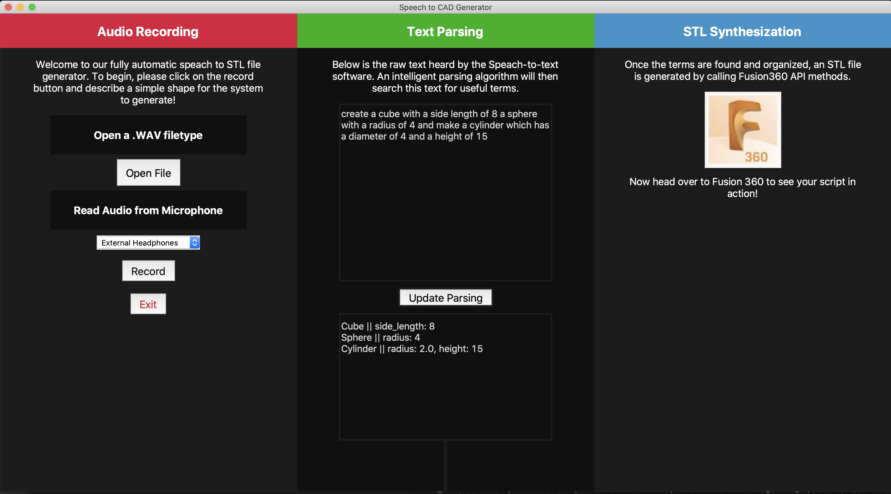

# Speech to CAD Model Generator

We worked on designing a fully integrated speech to STL model generator with an interactive GUI, as well a custom natural language processor to parse useful information from the text. To generate the 3d objects, we made calls to the Fusion360 API. 

Our algorithm used a four step process to construct these 3d objects from speech. 
1. Using our user-friendly GUI, you can record audio in natural language and watch our algorithm parse it for information in real time. If the algorithm mis-hears you, or the information it produces is incorrect, you can edit it within the Text element and the system will automatically reparse the new text. 
2. We used the speech_recognition and pyttsx3 modules to convert this raw audio into English text. You have the option to use your microphone to record, or even upload a pre-recorded .WAV file to the system, which it will then parse. This was extremely helpful during testing, and the system will always return the same text from a given .WAV. 
3. We custom-built a natural language parser to extract the necessary information from the English text. We incorporated intelligent feature extraction that compares user input with a corpus of keywords and trigger phrases. The system can detect multiple objects, and will consistently find what information is present, and what it needs to request. 
4. Using the key information extracted from the audio, we use the Fusion API to create a CAD model to suit the user’s needs. Our project generates CAD models based on user input, and can easily create models that it has never seen before.

Developed by Akash Pamal, Jack Blair, and Rohit Prasanna
HackNEHS 2021 4/4/21
MIT License

## Sources Cited:

https://forums.autodesk.com/t5/fusion-360-api-and-scripts/simple-python-example-request/td-p/5428202 
https://github.com/brysontyrrell/Python-GUI-Example/blob/master/Python-GUI-Example.py 
https://www.autodesk.com/autodesk-university/class/Getting-Started-Fusion-360-API-2020#handout 

